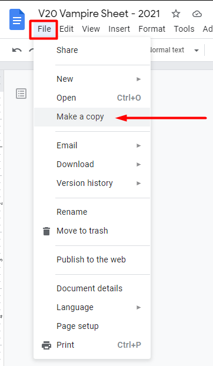
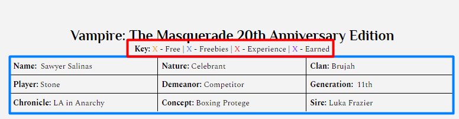
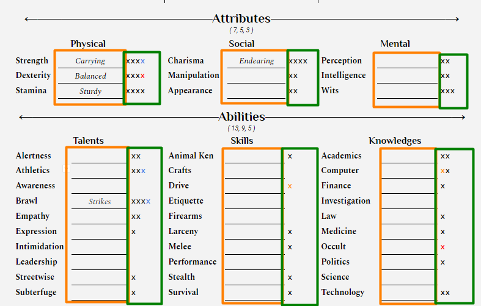

  

      Using the Character Sheet
  

The constant paper-shuffle of dealing with PDFs gets to be a hassle, which is why we only accept the google docs character sheets found below:

* <a href="http://bit.ly/Vampire-Sheet-2021">Vampire</a>
* <a href="http://bit.ly/Ghoul-Sheet-2021">Ghoul</a>
* <a href="http://bit.ly/human-sheet-2021">Human</a>

Creating the Sheet

After opening the link and making sure you're signed into a google account, go to File > make a copy, and save it somewhere into your drive.

<b>Important</b>

Don't open the sheet in Microsoft Word. The formatting won't transfer, and the whole thing will break.

Sheet Navigation

The key is to indicate how you got certain dots at a glance.

* <b>Base dots should remain black.</b> They're the dots you distribute though character creation (such as the 7/5/3 attribute dots).
* Free dots are any dots given by the Storyteller without requiring a cost
* Freebies mean any dots bought with freebies
* Experience are any dots bought with experience
* Earned are any dots earned in character. Normally, this will only apply to backgrounds, as they can't be purchased with experience directly.

The header is where all the basic information tied to a character goes. The grid is made from a table. Text can be entered to the right of the label in the same box.

Trait ratings/dots are marked with an x in the space to the right of the line.

<b>Important</b>

When you first open the sheet, it'll have a dot (x) in every ability. <b>This is only to show where they go.</b> Remove them before filling the sheet out.

Specialites are recorded on the line in between the trait's name and dot rating, much like on the traditional Vampire character sheet.

  
 

  

    La in Anarchy (LAiA) is not official World of Darkness material from White Wolf. Portions of this material are copyrights and trademarks of Paradox Interactive AB, and are used with permission. All rights reserved. For more information, please visit: <a href="https://worldofdarkness.com/">https://worldofdarkness.com/</a>
      
    

